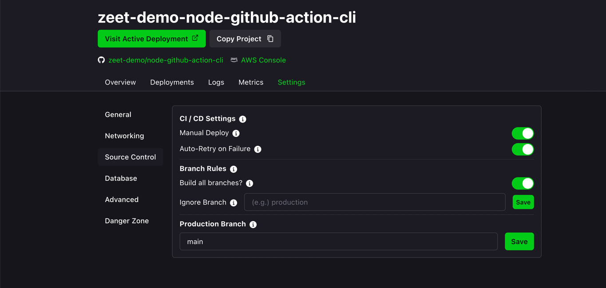

# Zeet Deploy Action

Use this Github Action to deploy a project on [Zeet](https://zeet.co).

## Example
Note: you probably want to enable Manual Deploys so that Zeet doesn't automatically rebuild your project on every commit:
<details>
<summary>Manual Deploy</summary>



</details>

```yaml
    steps:
      - name: Deploy project
        uses: zeet-co/zeet-deploy-action@v2
        with:
          deploy_key: ${{ secrets.ZEET_TOKEN }}
          project: zeet-demo/zeet-demo-node
          image: nginx:1.20
```

## Params

| Name         | Description                                                                                                                                          | Required                                    |
|--------------|------------------------------------------------------------------------------------------------------------------------------------------------------|:--------------------------------------------|
| api_url      | The Zeet API URL                                                                                                                                     | No                                          |
| deploy_key   | Zeet API Key: Create by going to https://zeet.co/account/api, or to [Dashboard](https://zeet.co/dashboard) > Team Settings > API Keys > New API Key. | Yes                                         |
| project_name | The project name                                                                                                                                     | Yes (or use project_id)                     |
| project_id   | The project id                                                                                                                                       | Yes (or use project_name)                   |
| image        | The Docker image to run                                                                                                                              | No (defaults to building the latest commit) |
| branch       | The branch to deploy to                                                                                                                              | No (defaults to the default branch)                          |
| wait         | Wait for the deploy to finish, while streaming its output                                                                                            | No (default false)                          |

## Outputs
`link`: the link to the deployment in the Dashboard
